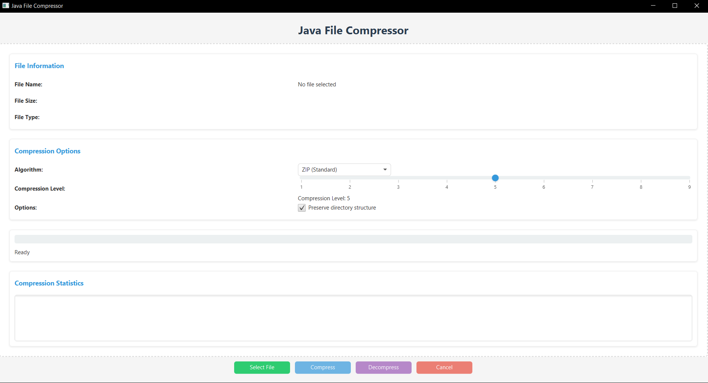

# Java File Compressor

A desktop application that allows users to compress and decompress files using various compression algorithms.



## Features

### Core Functionality

- **Multiple Compression Algorithms:** ZIP, GZIP, and BZIP2 compression support
- **Compression Level Control:** Adjust compression level (1-9) to balance speed and compression ratio
- **File/Directory Support:** Compress single files or entire directories
- **Progress Tracking:** Real-time progress updates during compression/decompression
- **Drag and Drop:** Easy file selection via drag and drop interface
- **Compression Statistics:** View size reduction and compression ratio data

### User Interface

- **Modern UI:** Clean, intuitive interface with clear sections
- **Visual Feedback:** Progress bar and status updates
- **File Information:** View details about selected files before compression
- **Error Handling:** User-friendly error messages

## Installation Instructions

### Prerequisites

- Java Development Kit (JDK) 17 or higher
- Maven (for building from source)

### Running the Application

1. Download the latest release JAR file
2. Run using: `java -jar java-file-compressor-1.0-SNAPSHOT.jar`

### Building from Source

```bash
git clone https://github.com/yourusername/java-file-compressor.git
cd java-file-compressor
mvn clean package
java -jar target/java-file-compressor-1.0-SNAPSHOT.jar
```

## Technical Details

### Technology Stack

- **Java 17:** Core programming language
- **JavaFX:** UI framework
- **Apache Commons Compress:** Compression algorithms
- **Maven:** Project management and build tool
- **SLF4J/Logback:** Logging framework

### Architecture

The application is built using a clean separation of concerns:

- **Model:** Data structures for file information and compression parameters
- **View:** JavaFX FXML-based UI components
- **Controller:** Business logic for handling user interactions
- **Service:** Compression/decompression operations

### Compression Algorithms

- **ZIP:** Standard compression format with good compatibility
- **GZIP:** Fast compression with good compression ratio
- **BZIP2:** Higher compression ratio but slower than GZIP

## Usage Examples

### Compressing a File

1. Click "Select File" or drag and drop a file onto the application
2. Choose compression algorithm (ZIP, GZIP, BZIP2)
3. Adjust compression level (1-9)
4. Click "Compress"

### Decompressing a File

1. Select a compressed file (.zip, .gz, .bz2)
2. Click "Decompress"

## Future Enhancements

1. Support for more compression algorithms
2. Batch processing multiple files
3. Password protection for compressed files
4. Command-line interface
5. Dark mode UI

## License

This project is licensed under the MIT License - see the LICENSE file for details.

## Acknowledgments

- Apache Commons Compress for providing compression algorithms
- JavaFX for the UI framework
- The open source community for their valuable resources
