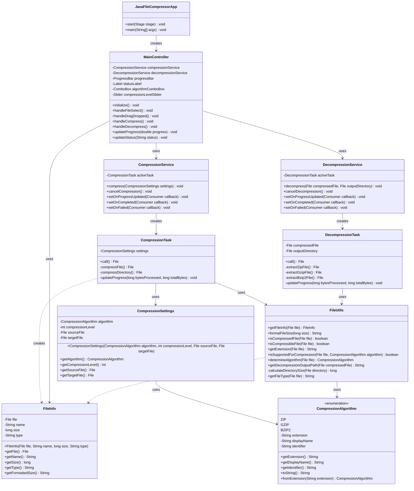

# Java File Compressor - Class Diagram

Below is the class diagram for the Java File Compressor application, showing the main components and their relationships.

## Diagram Explanation

The diagram represents the Java File Compressor application architecture with the following components:

1. **JavaFileCompressorApp**: The main application class that initializes the JavaFX UI.

2. **Model Classes**:

   - `FileInfo`: Stores information about files being processed
   - `CompressionSettings`: Configuration for compression operations
   - `CompressionAlgorithm`: Enum representing supported compression algorithms (ZIP, GZIP, BZIP2)

3. **Controller Classes**:

   - `MainController`: Handles UI events and coordinates between the view and services

4. **Service Classes**:

   - `CompressionService`: Manages compression operations
   - `DecompressionService`: Manages decompression operations

5. **Background Task Classes**:

   - `CompressionTask`: Performs actual compression work in the background
   - `DecompressionTask`: Performs actual decompression work in the background

6. **Utility Classes**:
   - `FileUtils`: Common file handling utilities used throughout the application

The arrows in the diagram show the relationships between classes, such as which classes create or use other classes.
